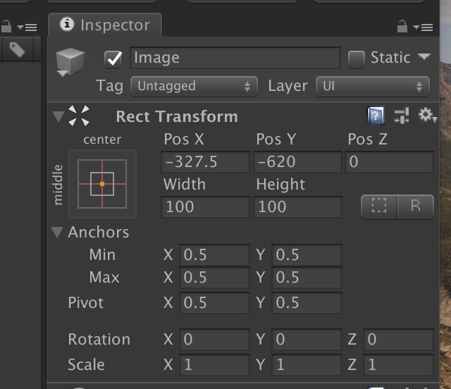

# 
 Unity UI 基础

## 
1.RectTransform 基本概念 

* RectTransform 图片

* Anchored Position :代表物体pivot相对于Anchors锚点的几何中心点的位置
* Position :   物体pivot相对与父物体的rect的几何中心点的位置 
* SizeDelta:   OffsetMax - OffsetMin 
* 安全获取UI宽高的方式： RectTransform.rect 结构体 

* 两种编辑模式
    1. Blueprint mode: 用于控制UI物体的Rect是否进行与UI物体的缩放旋转自动包含适应。

## 
2.Canvas
 

* Canvas的3种渲染模式

* UI&像素的对应关系

* ConstantPixelSize 模式下的UI适配
 

* 常用UI适配方式
